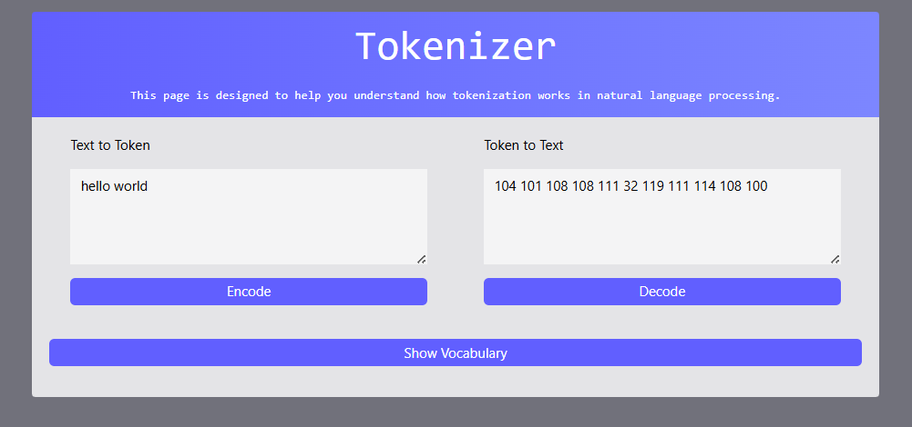

# 🧠 Tokenizer — A Simple GPT-Style Tokenization Demo

This project is a **demonstration of how tokenization works behind the scenes** in GPT-like models.  
It allows you to see how text is broken down into tokens and how those tokens can be converted back into text — using a simple **character-to-token vocabulary**.

---

## 📸 First Impressions

Here are some screenshots of the **Tokenizer** in action:

---

## 🎯 Features

- **Two Fields**  
  - **Text Field** → Enter any text you want to tokenize.  
  - **Token Field** → See the token representation of your text.  

- **Two Conversion Buttons**  
  - **Encode Button** → Convert text into tokens.  
  - **Decode Button** → Convert tokens back into text.  

- **Custom Vocabulary**  
  - Each character has a token value based on a simple mapping.  
  - Works as a beginner-friendly tokenizer simulation.

---

## 🛠 Tech Stack

- **HTML** – For the basic structure  
- **JavaScript** – For tokenization logic (encoding & decoding)  
- **Tailwind CSS** – For quick and responsive styling

---

